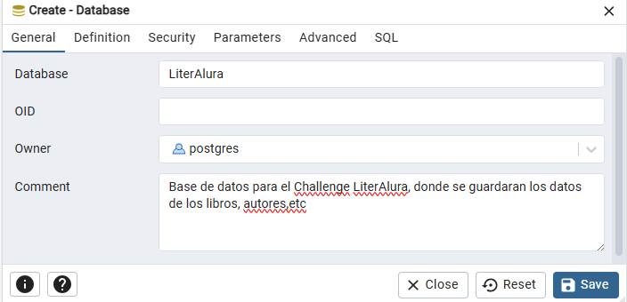
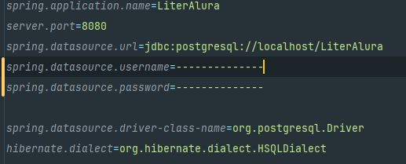

 

  

![Alura]
  <h1>📚Challenge: LiterAlura 📚➡💻</h1> 
  

    Proyecto catálogo de libros mediante la consulta de API y la persistencia de los datos en una base 
    de datos, esta aplicación nos permitirá la consulta de libros y su información, artistas y sus 
    obras, entre otras funcionalidades.
  

---

Indice

- [🤔Acerca del proyecto](#acerca-del-proyecto)
- [👷‍♂️Construido con:](#️construido-con)
- [🛠Cómo empezar.](#cómo-empezar)
    - [📜Requisitos](#requisitos)
    - [🔢 Pasos](#-pasos)
- [🛶Funcionamiento](#funcionamiento)
    - [✅ Menu principal](#-menu-principal)
        - [🔀 Convertir moneda](#-convertir-moneda)
        - [🔙 Historial de conversiones](#-historial-de-conversiones)
        - [❌ Salir](#-salir)
    - [🚓Excepciones y contramedidas](#excepciones-y-contramedidas)
- [Roadmap](#roadmap)

---

## 🤔Acerca del proyecto

Este interesante proyecto, haremos uso de los conocimientos aprendidos en el curso
**java trabajando con lambdas, streams y spring framework** y **java persistencia de 
datos y consultas con spring data JPA** impartidos por **ALURA Latam - ONE** (Oracle Next Education).

Este proyecto hará uso de:

- Consultas API.
- Programacion Orientada a Objetos POO.
- Uso de lambdas, streams.
- Uso de Spring Framework.
- Persistencia de datos DB.

Mediante estas herramientas se crea una app de consola de un catálogo de libros, y con el uso
de la API [Guntendex](https://gutendex.com/) para obtener la información de los libros consultados.

Otras funcionalidades que ofrece la aplicacion son:

- Listar libros consultados
- Listar autores registrados
- Listar autores vivos en un determinado año
- listar libros por idioma

---

## 👷‍♂️Construido con:

Su construcción fue mediante las siguientes herramientas:

![Java]
![IntelliJ IDEA]
![Git]
![GitHub]
![Spring Boot]
![Postgres]

## 🛠Cómo empezar.

### 📜Requisitos

- Tener instalado Java JDK 17.0.6.
- OPCIONAL: Un IDE que ejecute Java (IntelliJIDEA, NeatBeans)
- Conexión a internet para consultar la API.
- Spring 3.5.4
- Tener instalado Postgres 16 en adelante.

### 🔢 Pasos

1. Descargar o clonar este repositorio.

   ``

2. Abrir el repositorio con el IDE preferido.
3. Compilar y ejecutar el proyecto.

## 🛶Funcionamiento

En el siguiente GIF podemos ver el funcionamiento principal de la apliccaion.

### ✅ Menu principal

Al ejecutar la aplicacion, lo primero que podemos encontrar es un menu principal con  opciones.

 

#### ❌ Salir

La última opcion `Salir` termina la ejecucioin de la aplicacion.

### 🚓Excepciones y contramedidas

Se tomaron en cuenta las posibles fallas que se pueden tener en la aplicacion como es ingresar datos no válidos,
lo que provocaria posibles fallas.

1. Ingresar opciones no disponibles.
2. Valores negativos.
3. Ingresar otro tipo de datos (letras).

## Roadmap

En esta primera version, se logró el objetivo de la aplicacion de conversion de divisas y la conservacion del historial
de conversiones.
Pero aún se puede tener mejoras futuras:

- [x] 

<a href="#readme-top">regresar al inicio</a>

[Java]:https://img.shields.io/badge/Java-%23ED8B00.svg?logo=openjdk&logoColor=white
[IntelliJ IDEA]:https://img.shields.io/badge/IntelliJIDEA-000000.svg?logo=intellij-idea&logoColor=white
[Git]:https://img.shields.io/badge/Git-F05032?logo=git&logoColor=fff
[GitHub]:https://img.shields.io/badge/GitHub-%23121011.svg?logo=github&logoColor=white
[Alura]:https://custom-icon-badges.demolab.com/badge/Alura-001332?logo=alura-white&logoColor=fff
[Spring Boot]:https://img.shields.io/badge/Spring%20Boot-6DB33F?logo=springboot&logoColor=fff
[Postgres]:https://img.shields.io/badge/Postgres-%23316192.svg?logo=postgresql&logoColor=white